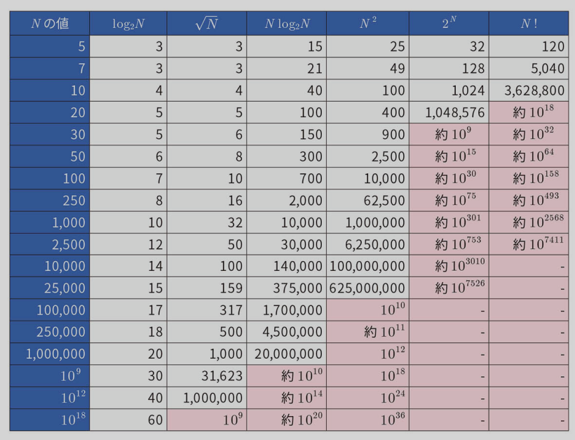
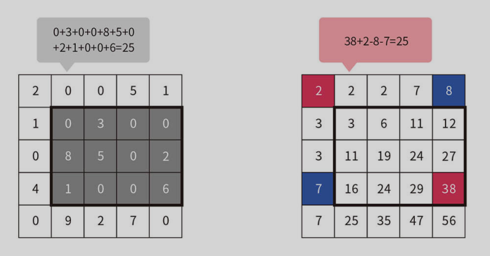

# Readme

[競プロ典型 90 問 - AtCoder](https://atcoder.jp/contests/typical90)を解く

## 用語

- 俯角: 水平面から下にある物を見る視線と水平面が成す角
- 仰角: 物を見上げた時の視線と水平面が成す角

## 計算量の雑な見積もり

１秒間で処理できる計算ステップ回数は 109 ＝ 1,000,000,000 回程度

- O(log N): いっぱい
- O(N): 10^8
- O(N log N): 10^7
- O(N^2): 10^4
- O(N^3): 300
- O(2^N): 20
- O(N!): 10

指数時間: O(2^N) とか O(N!) とか
多項式時間: O(N^2) とか O(N^3) とか

2^10 -> 1024: だいたい 10^3



## セグメント木

指定区間の最小値を得る、みたいなクエリで使える

- 構築に O(N)
- 区間に対するクエリに O(logN)

遅延評価セグメント木

- 区間加算: O(logN)
- 最小値計算: O(logN)

## 二分探索

```rust
let v = vec![0, 1, 2, 3, 4, 5, 6];
let i = v.binary_search_by(|&x| {
    if x <= 3 {
        std::cmp::Ordering::Less
    } else {
        std::cmp::Ordering::Greater
    }
}).unwrap_err();
// i == 4 となる
```

## 組み合わせ

nC2 = n(n-1)/2

## Union-Find

- 構築に O(N)

```rust
pub struct UnionFind {
    parent: Vec<usize>,
    rank: Vec<usize>,
    size: Vec<usize>,
}

impl UnionFind {
    // O(N)
    fn new(n: usize) -> Self {
        UnionFind {
            parent: (0..n).collect(),
            rank: vec![0; n],
            size: vec![1; n],
        }
    }

    // O(α(N)) ≒ O(1)
    fn find(&mut self, x: usize) -> usize {
        if self.parent[x] == x {
            x
        } else {
            let p = self.find(self.parent[x]);
            self.parent[x] = p;
            p
        }
    }

    // O(α(N)) ≒ O(1)
    fn unite(&mut self, x: usize, y: usize) {
        let x = self.find(x);
        let y = self.find(y);
        if x == y {
            return;
        }
        if self.rank[x] < self.rank[y] {
            self.parent[x] = y;
            self.size[y] += self.size[x];
        } else {
            self.parent[y] = x;
            self.size[x] += self.size[y];
            if self.rank[x] == self.rank[y] {
                self.rank[x] += 1;
            }
        }
    }

    // O(α(N)) ≒ O(1)
    fn same(&mut self, x: usize, y: usize) -> bool {
        self.find(x) == self.find(y)
    }
}
```

## ヒープ

完全 2 分木

- 構築に O(N)
- 要素の追加・削除・更新に最悪でも O(logN)
- 最大値の取得に O(1)
- 要素数の取得に O(1)
- 親ノードは子ノードよりも常に大きい(小さい)という性質を持つ

## 最短経路

ダイクストラ法

- 重み付き有向グラフの単一始点最短経路問題を解くアルゴリズム
- 単純な DP を使うと O(V^2) で計算
- ヒープを使うと O(ElogV) で計算
- TODO: 負の重みを持つエッジがある場合は適用できない？？？

## DP の tips

- 値が bool の DP は bit DP で高速化できる(典型 90 問 012 の解説動画参照)
  - i 行目と i+1 行目の状態を OR すると i+1 行目の状態が得られる
    - 64 倍の高速化
- DP で辿った順序は、DP を埋めたあとに逆順に辿ると得られる

## 強連結成分分解(SCC)

Strongly Connected Components

- 有向グラフで互いの頂点に到達可能な時、強連結成分という。
- 深さ優先探索を 2 回する

1. DFS で帰りがけ順に番号を記録する
2. 辺の向きをすべて反転させる
3. 1.を逆順にする
4. 2.のグラフを 3.の順番に DFS し、到達した頂点を 1 つの強連結成分とする

## いもす法

- 重なり合う区間の数を累積和を使って数える方法
- 2 次元や 3 次元への拡張が容易
  - 例えば 2 次元なら O(NHW) かかるところを O(N+HW) で済ませられる

1. 始点にプラスの、終点にマイナスの重みをつける
2. 各軸の累積和を取る（これによりマイナスの重みをつけた部分は打ち消される）



## Nim のセオリーと Grundy 数

参考: [組み合わせゲーム理論の基礎と Grundy 数での勝敗判定アルゴリズム | アルゴリズムロジック](https://algo-logic.info/combinatorial-games/#)

Nim のセオリー

- 山ごとに Grundy 数を求める
- それら Grundy 数すべてを XOR する
- 結果が 0 なら負け、0 以外なら勝ち

Grundy 数

- ある状態から遷移可能な状態の Grundy 数の集合の最小の非負整数
- 例えば、ある状態から遷移可能な状態の Grundy 数が {0, 1, 3} なら、その状態の Grundy 数は 2

## 重複組合せ

N-1 箇所の隙間から K-1 個の隙間を選んで仕切りを入れる場合の数は {N-1}_C_{K-1}

> o o o | o | o o o o | o o o
> N = 11, K = 4 の場合の一例 (10C3 通りある)

[AtCoder ABC 132 D - Blue and Red Balls (緑色, 400 点) - けんちょんの競プロ精進記録](https://drken1215.hatenablog.com/entry/2019/06/30/183400)

## オイラーツアー

DFS で木構造をたどる

## LCA

Lowest Common Ancestor

- 2 頂点の共通の祖先のうち、最も深いもの
- オイラーツアーを使うと O(N) で求められる
- 2 頂点(A, B)の距離を求められる
  - 根から A までの距離 + 根から B までの距離 - 2 x 根から LCA までの距離

## マンハッタン距離

|x1 - x2| + |y1 - y2|

以下のように 45 度回転させると

(u, v) = (x + y, x - y)

マンハッタン距離は以下のように表せる（チェビシェフ距離）

max(|u1 - u2|, |v1 - v2|)

証明

|x1 - x2| + |y1 - y2| = max(x1 - x2, x2 - x1) + max(y1 - y2, y2 - y1) とも表すことができるので、この右辺を式変形するとチェビシェフ距離になる。

## スライド最大値

Sliding Window Maximum

- 配列の連続する部分列の最大値を求める
- Deque を使うと O(N) で求められる
- 常に Deque の先頭が最大値になるようにする
- ウィンドウが右に移動する時に以下を行うことで Deque の先頭が常に最大になり、更新が O(1) でできる
  - 左端の値を削除
  - 右端の値を追加する時に、Deque の末尾から追加しようとしている値より小さな値を削除する

## 9 の倍数の性質

(N mod 9) = (N の各桁の和 mod 9)

## mod の性質

- (a + b) mod p = ((a mod p) + (b mod p)) mod p

## 01-BFS

- 辺の重みが 0 か 1 のグラフの最短経路を求める
- 通常の BFS ではなく、Deque を使う
- 重みが 0 の辺は先頭に、重みが 1 の辺は末尾に追加する
- 重みが 0 の辺は先に探索されるので、最短経路が求まる

## ベル数

n 個の要素を k 個のグループに分ける場合の数

- 例: 4 個の要素の場合、 {4}, {3, 1}, {2, 2}, {2, 1, 1}, {1, 1, 1, 1} の 5 通り
- ベル数の三角形を作ることで求められる

```text
   1
  1 2
 2 3 5
5 7 10 15
```

## パスカルの三角形

上から n 段目、左から k 番目の値は {n - 1}_C_{k - 1} である

```text
    1
   1 1
  1 2 1
 1 3 3 1
1 4 6 4 1
```

## bit 判断

以下は等価

```cpp
if ((bit & (1 << i)) != 0) {
  // i 番目の bit が立っている
}
if (((bit >> i) & 1) == 1) {
  // i 番目の bit が立っている
}
```

## 約数の個数

n の約数の個数は、n を素因数分解した時の指数の値に 1 を足したもの同士を掛け合わせたものになる
例: 24 = 2^3 x 3^1 なので、約数の個数は (3 + 1) x (1 + 1) = 8

```rust
// エラトステネスの篩を利用して n までの各整数の約数の個数を計算
fn divisor_counts(n: usize) -> Vec<usize> {
    let mut count = vec![0usize; n + 1];
    for i in 1..=n {
        let mut j = i;
        while j <= n {
            count[j] += 1;
            j += i;
        }
    }
    count
}
```

## 和の公式

- 1 から N までの総和は (N / 2) x (N + 1) で求められる
  - たとえば、1 から 50 の場合は 25 x 51 = 1275
  - これは、1 + 50 = 51, 2 + 49 = 51, 3 + 48 = 51, ... となるので、25 個の 51 で構成されるため
- a^0 + a^1 + a^2 + ... = 1/(1-a) | 0 < a < 1
  - 例えば、a = 0.5 の時、 1 + 0.5 + 0.25 + ... = 2

## 半分全列挙

全列挙すると TLE になる場合に、二分探索を使える状態にしてから全列挙するとうまく行くことがある。
例えば、A,B,C,D からそれぞれ 1 つずつ選んでその合計がある条件を満たすかを全列挙する場合、A,B と C,D に分けて考えることができる。O(N^3) -> O(N^2 log N)になる。

## 整数 X が 2 で何回割り切れるか

X を 2 進数表記して 1 のくらいから 0 が何回連続しているか
例: 32(10) = 0010 0000(2) なので、5 回
例: 33(10) = 0010 0001(2) なので、0 回

```rust
assert!(32usize.trailing_zeros() == 5);
```

## Rust

```rust
// 配列の連続した重複要素の除去
a.sort();
a.dedup();
```
